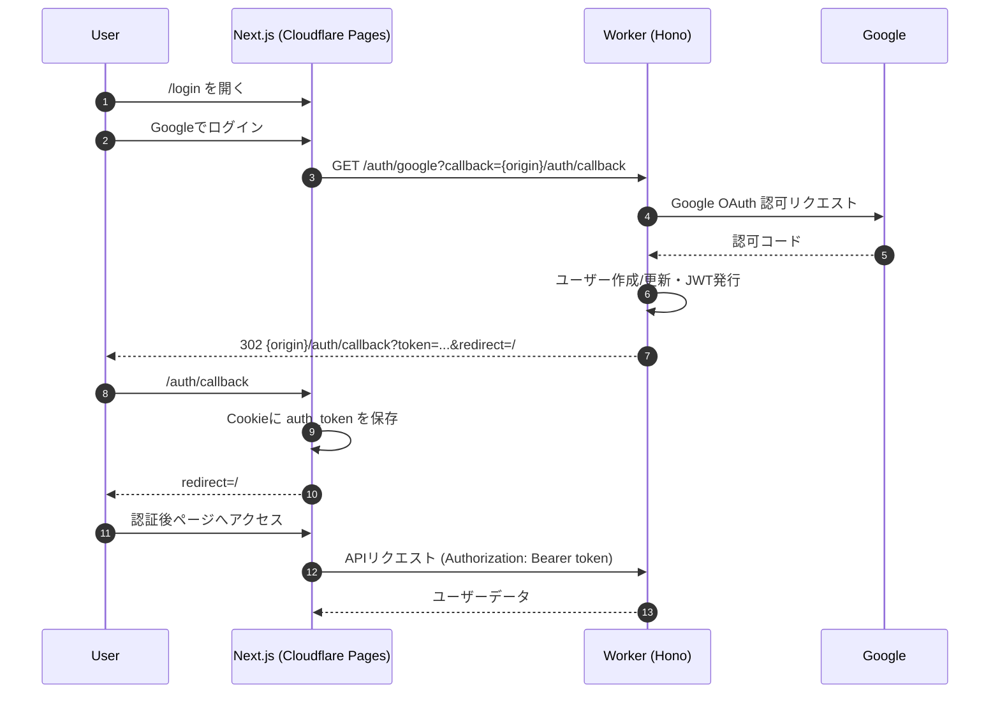

# MLM-DX

MLM-DXは、バンド管理システムです。Next.jsフロントエンド（Cloudflare Pages）とCloudflare Workersバックエンド（D1/SQLite）で構成されています。

## プロジェクト構造

```
mlm-dx/
├── apps/
│   ├── web/          # Next.jsフロントエンド
│   └── worker/       # Cloudflare Workersバックエンド
├── package.json      # ルートレベルの設定
└── README.md
```

## セットアップ

### 1. 依存関係のインストール

```bash
npm install
```

### 2. Cloudflare D1データベースのセットアップ

```bash
# D1データベースを作成
npm run db:create

# マイグレーションを実行
npm run db:migrate

# サンプルデータを投入（オプション）
npm run db:seed
```

### 3. 環境変数の設定

#### apps/web/.env.local
```env
NEXT_PUBLIC_API_URL=https://your-worker-domain.workers.dev
```

Workers側の環境変数は`apps/worker/wrangler.toml`に設定します。

### 4. 開発サーバーの起動

#### ローカル開発（推奨）
```bash
# フロントエンドとバックエンドを並行実行（ローカル）
npm run dev:all:local

# または個別に実行
npm run dev              # フロントエンド
npm run dev:worker:local  # バックエンド（ローカル）
```

#### リモート開発
```bash
# フロントエンドとバックエンドを並行実行（リモート）
npm run dev:all

# または個別に実行
npm run dev        # フロントエンド
npm run dev:worker  # バックエンド（リモート）
```

## デプロイ

### Cloudflare Workers

```bash
npm run deploy:worker
```

### Next.js（Cloudflare Pages）

apps/web:
```bash
npm run build:cf        # .vercel/output を生成
npm run preview         # ローカルプレビュー（wrangler pages dev）
npm run deploy          # Cloudflare Pages へデプロイ
```

## 機能

- ユーザー認証（JWT）
- バンド管理
- メンバー管理
- 予約管理
- アーカイブ管理

## 認証仕様（Pages × Workers）

- フロント`/login` → Workersの`/auth/google?callback={ORIGIN}/auth/callback`にリダイレクト
- Google同意後、WorkersがJWTを発行し`/auth/callback?token=...&redirect=/`へリダイレクト
- フロントは`auth_token`をCookieに保存（Path=/, SameSite=Lax, Secure(HTTPS)）
- 以降のAPIは`Authorization: Bearer <token>`を付与
- サインアウトは`auth_token` Cookie削除

### 認証フロー図



## 主なAPIエンドポイント（例）

- `GET /auth/google` - Googleログイン開始（Workers）
- `GET /api/users/me` - 自分のユーザー情報を取得
- `GET /api/bands` - バンド一覧
- `POST /api/bands` - バンド作成
- `GET /api/members/band/:bandId` - メンバー一覧
- `POST /api/members/band/:bandId` - メンバー追加
- `GET /api/reservations/band/:bandId` - 予約一覧
- `POST /api/reservations/band/:bandId` - 予約作成
- `GET /api/archive/band/:bandId` - アーカイブ一覧
- `POST /api/archive/band/:bandId` - アーカイブ追加