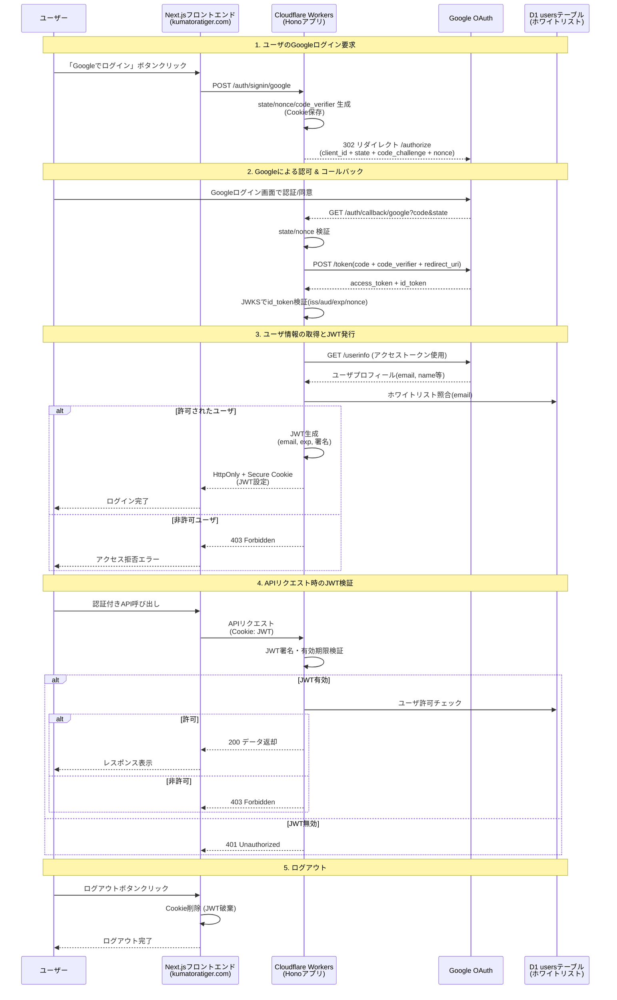
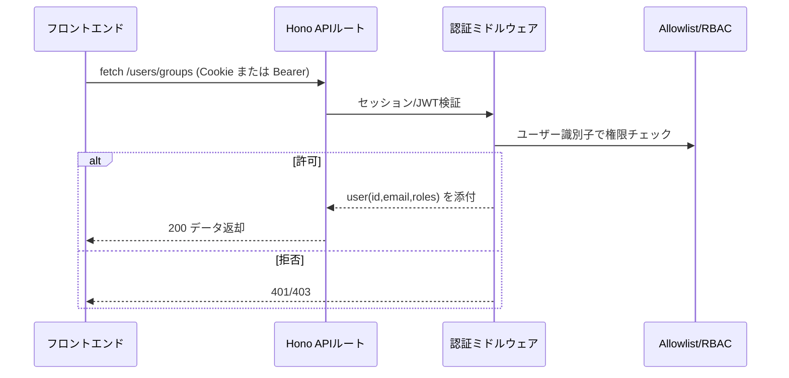

# MLM-DX

MLM-DXは、バンド管理システムです。Next.jsフロントエンド（Cloudflare Pages）とCloudflare Workersバックエンド（D1/SQLite）で構成されています。

## プロジェクト構造

```
mlm-dx/
├── apps/
│   ├── web/          # Next.jsフロントエンド
│   └── worker/       # Cloudflare Workersバックエンド
├── package.json      # ルートレベルの設定
└── README.md
```

## 主な機能

- **予約管理**: バンドまたは個人名義でスタジオ予約を作成・閲覧・キャンセル。予約日の午前0時（JST）に自動判定を行い、同日予約は即時に確定/却下を決定します。
- **イベント / エントリー**: エントリー受付状態と締切を管理し、バンド構成員の重複上限（`group_limit`）をチェックします。
- **セットリスト**: エントリーごとの曲順を登録・一括置換。SE（位置0）や楽曲上限 (`song_limit`) に対応し、締切以降の更新を拒否します。
- **タイムライン**: イベントの進行表（開始/終了時刻、出演順）を管理。管理者は番号重複や欠番を持たないように一括更新できます。
- **メンバー管理**: 管理者による個別追加・一括登録・編集・削除。メンバー選択用の軽量APIも提供します。
- **アーカイブ**: 過去ライブの映像や情報を保存するCRUD APIを提供します。

## セットアップ

### 1. 依存関係のインストール

```bash
pnpm install
```

### 2. Cloudflare D1データベースのセットアップ

#### ローカル開発環境
```bash
# ローカルD1データベースは自動的に作成されます（wrangler dev実行時）
# 既存データを保持してマイグレーションを実行
pnpm run db:migrate:local

# サンプルデータを投入（オプション）
pnpm run seed -- user add --email="test@example.com" --grade=2

# または一括でセットアップ
pnpm run db:setup:local
```

#### 本番環境（クラウド）
```bash
# 本番環境D1データベースを作成
pnpm run db:create:prod

# 既存データを保持してマイグレーションを実行
pnpm run db:migrate:prod

# サンプルデータを投入（オプション）
pnpm run seed -- user add --email="test@example.com" --grade=2

# または一括でセットアップ
pnpm run db:setup:prod
```

### 3. Google OAuth設定

#### 3.1 Google Cloud Console でプロジェクトを作成

1. [Google Cloud Console](https://console.cloud.google.com/)にアクセス
2. 新しいプロジェクトを作成するか、既存のプロジェクトを選択

#### 3.2 OAuth 2.0 認証情報を設定

**OAuth同意画面の設定:**
1. 左側のメニューから「APIとサービス」→「OAuth同意画面」を選択
2. ユーザータイプを選択（外部を推奨）
3. アプリ情報を入力：
   - アプリ名: `MLM-DX`
   - ユーザーサポートメール: あなたのメールアドレス
   - デベロッパーの連絡先情報: あなたのメールアドレス
4. スコープの追加:
   - `.../auth/userinfo.email`
   - `.../auth/userinfo.profile`
5. テストユーザーを追加（開発中は必要）

**OAuth 2.0 クライアントIDの作成:**
1. 「認証情報」タブを選択
2. 「認証情報を作成」→「OAuth 2.0 クライアントID」を選択
3. アプリケーションの種類: `ウェブアプリケーション`
4. 名前: `MLM-DX Worker`
5. **承認済みのJavaScript生成元**を追加:

**開発環境:**
```
http://localhost:3000
http://127.0.0.1:3000
```

**本番環境:**
```
https://your-frontend-domain.com
```

6. **承認済みのリダイレクトURI**を追加:

**開発環境:**
```
http://localhost:8787/auth/callback/google
```

**本番環境:**
```
https://mlm-dx-worker.your-account.workers.dev/auth/callback/google
```

7. 「作成」をクリック
8. クライアントIDとクライアントシークレットをコピー

### 4. 環境変数の設定

#### 4.1 AUTH_SECRETの生成

ターミナルで以下のコマンドを実行:
```bash
openssl rand -base64 32
```

#### 4.2 フロントエンド（apps/web/.env.local）

**開発環境用の設定:**
```env
# 環境設定
NODE_ENV=development

# API設定
NEXT_PUBLIC_API_URL=http://localhost:8787

# Google One Tap設定
NEXT_PUBLIC_GOOGLE_CLIENT_ID=your-dev-google-client-id
```

**本番環境用の設定:**
```env
# 環境設定
NODE_ENV=production

# API設定
NEXT_PUBLIC_API_URL=https://your-worker-domain.workers.dev

# Google One Tap設定
NEXT_PUBLIC_GOOGLE_CLIENT_ID=your-google-client-id
```

#### 4.3 バックエンド（apps/worker/.dev.vars）

**開発環境用の設定:**
```env
# 環境設定
NODE_ENV=development
AUTH_URL=http://localhost:8787

# 認証設定
AUTH_SECRET=your-auth-secret-min-32-chars-long
GOOGLE_CLIENT_ID=your-google-client-id
GOOGLE_CLIENT_SECRET=your-google-client-secret

# CORS設定
CORS_ORIGIN=http://localhost:3000
FRONTEND_URL=http://localhost:3000

# SMTP通知設定（465はtls、587はstarttls）
SMTP_HOST=smtp.example.com
SMTP_PORT=465
SMTP_SECURITY=tls
SMTP_USER=your-smtp-user
SMTP_PASSWORD=your-smtp-password
SMTP_FROM_EMAIL=no-reply@example.com
SMTP_FROM_NAME=MLM-DX
```

#### 4.4 バックエンド（apps/worker/wrangler.toml）

```toml
name = "mlm-dx-worker"
main = "src/index.ts"
compatibility_date = "2024-12-20"

[triggers]
crons = ["0 15 * * *"]

[env.development]
name = "mlm-dx-worker-dev"

[env.production]
name = "mlm-dx-worker"

[[d1_databases]]
binding = "DB"
database_name = "mlm-dx-db"
database_id = "your-production-database-id"

# 共通設定
[vars]
CORS_ORIGIN = "https://your-frontend-domain.com"
FRONTEND_URL = "https://your-frontend-domain.com"

# 本番環境設定（機密情報はwrangler secret putで管理）
[env.production.vars]
CORS_ORIGIN = "https://your-frontend-domain.com"
FRONTEND_URL = "https://your-frontend-domain.com"
SMTP_HOST = "smtp.example.com"
SMTP_PORT = "465"
SMTP_SECURITY = "tls"
SMTP_FROM_EMAIL = "no-reply@example.com"
SMTP_FROM_NAME = "MLM-DX"

# 開発環境設定（機密情報は.dev.varsファイルで管理）
[env.development.vars]
CORS_ORIGIN = "http://localhost:3000"
FRONTEND_URL = "http://localhost:3000"
```

イベント終了後のクリーンアップ処理（`deleteExpiredEvents`）も有効にする場合は、`crons` に `"0 16 * * *"` を追加してください。

#### 4.5 環境変数の詳細説明

**フロントエンド環境変数:**

| 変数名 | 説明 | 開発環境 | 本番環境 |
|--------|------|----------|----------|
| `NODE_ENV` | 環境設定 | `development` | `production` |
| `NEXT_PUBLIC_API_URL` | バックエンドAPIのURL | `http://localhost:8787` | `https://your-worker-domain.workers.dev` |
| `NEXT_PUBLIC_GOOGLE_CLIENT_ID` | Google One Tap 用 OAuth クライアントID | 既存 `GOOGLE_CLIENT_ID` と同じ値 | 既存 `GOOGLE_CLIENT_ID` と同じ値 |

**バックエンド環境変数:**

| 変数名 | 説明 | 開発環境 | 本番環境 |
|--------|------|----------|----------|
| `NODE_ENV` | 環境設定（クッキーのsecure設定に影響） | `development` | `production` |
| `AUTH_URL` | 認証コールバック用のURL | `http://localhost:8787` | `https://your-worker-domain.workers.dev` |
| `AUTH_SECRET` | JWTトークンの署名用秘密鍵 | `.dev.vars`ファイル | `wrangler secret put` |
| `GOOGLE_CLIENT_ID` | Google OAuth クライアントID | `.dev.vars`ファイル | `wrangler secret put` |
| `GOOGLE_CLIENT_SECRET` | Google OAuth クライアントシークレット | `.dev.vars`ファイル | `wrangler secret put` |
| `CORS_ORIGIN` | CORS許可オリジン | `http://localhost:3000` | `https://your-frontend-domain.com` |
| `FRONTEND_URL` | フロントエンドのURL | `http://localhost:3000` | `https://your-frontend-domain.com` |
| `SMTP_HOST` | SMTPサーバーのホスト名 | `.dev.vars`ファイル | GitHub Repository Variable |
| `SMTP_PORT` | SMTPポート（`465`または`587`） | `.dev.vars`ファイル | GitHub Repository Variable |
| `SMTP_SECURITY` | 暗号化方式（`tls`または`starttls`） | `.dev.vars`ファイル | GitHub Repository Variable |
| `SMTP_USER` | SMTP認証ユーザー名 | `.dev.vars`ファイル | GitHub Repository Secret |
| `SMTP_PASSWORD` | SMTP認証パスワード | `.dev.vars`ファイル | GitHub Repository Secret |
| `SMTP_FROM_EMAIL` | 通知メールの送信元アドレス | `.dev.vars`ファイル | GitHub Repository Variable |
| `SMTP_FROM_NAME` | 通知メールの送信者名 | `.dev.vars`ファイル | GitHub Repository Variable |

#### 4.6 機密情報の管理方法

**本番環境（wrangler secret put）:**
本番環境の機密情報は`wrangler secret put`コマンドで安全に管理します：

```bash
# 本番環境の機密情報を設定
wrangler secret put AUTH_SECRET --env production
wrangler secret put GOOGLE_CLIENT_ID --env production
wrangler secret put GOOGLE_CLIENT_SECRET --env production
wrangler secret put SMTP_USER --env production
wrangler secret put SMTP_PASSWORD --env production
```

**開発環境（.dev.varsファイル）:**
開発環境の機密情報は`apps/worker/.dev.vars`ファイルで管理します：

```env
AUTH_SECRET=your-dev-auth-secret-here-min-32-chars-long
GOOGLE_CLIENT_ID=your-dev-google-client-id
GOOGLE_CLIENT_SECRET=your-dev-google-client-secret
SMTP_HOST=smtp.example.com
SMTP_PORT=465
SMTP_SECURITY=tls
SMTP_USER=your-dev-smtp-user
SMTP_PASSWORD=your-dev-smtp-password
SMTP_FROM_EMAIL=no-reply@example.com
SMTP_FROM_NAME=MLM-DX
```

GitHub Actionsから本番デプロイする場合は、リポジトリ設定へ次を登録します。

**Repository Variables（必須）:**

| 変数名 | 設定内容 |
|--------|----------|
| `NODE_ENV` | `production` |
| `AUTH_URL` | Workerの本番URL |
| `CORS_ORIGIN` | Webフロントエンドの本番URL |
| `FRONTEND_URL` | Webフロントエンドの本番URL |
| `D1_DATABASE_ID` | 本番D1データベースID |
| `CLOUDFLARE_ACCOUNT_ID` | CloudflareアカウントID |
| `NEXT_PUBLIC_API_URL` | ブラウザからアクセスするWorkerの本番URL |
| `SMTP_HOST` | SMTPサーバーのホスト名 |
| `SMTP_PORT` | `465`または`587` |
| `SMTP_SECURITY` | 465の場合は`tls`、587の場合は`starttls` |
| `SMTP_FROM_EMAIL` | 通知メールの送信元アドレス |
| `SMTP_FROM_NAME` | 通知メールに表示する送信者名 |

**Repository Variables（任意）:**

| 変数名 | 設定内容 |
|--------|----------|
| `NEXT_PUBLIC_GOOGLE_CLIENT_ID` | Google One Tap用クライアントID。未設定時は`GOOGLE_CLIENT_ID` Secretを使用 |

**Repository Secrets（必須）:**

| Secret名 | 設定内容 |
|----------|----------|
| `CLOUDFLARE_API_TOKEN` | WorkersとD1をデプロイできるCloudflare APIトークン |
| `AUTH_SECRET` | JWT署名用の32文字以上のランダム値 |
| `GOOGLE_CLIENT_ID` | Google OAuthクライアントID |
| `GOOGLE_CLIENT_SECRET` | Google OAuthクライアントシークレット |
| `SMTP_USER` | SMTP認証ユーザー名 |
| `SMTP_PASSWORD` | SMTP認証パスワード |

`.github/workflows/deploy.yml` はデプロイ前にSMTPの必須値とポート・暗号化方式の組み合わせを検証し、`SMTP_USER`と`SMTP_PASSWORD`をWorker Secretsとしてproduction環境へ登録します。
`GITHUB_TOKEN`はGitHub Actionsが自動発行するため、手動登録は不要です。

**注意事項:**
- `AUTH_SECRET`は最低32文字以上のランダムな文字列である必要があります
- `NODE_ENV`の設定により、クッキーの`secure`属性が自動的に制御されます（開発環境: `false`、本番環境: `true`）
- 開発環境と本番環境では**必ず異なる**クライアントIDとシークレットを使用してください
- 本番環境では`https`プロトコルを使用し、適切なドメインを設定してください
- 認証はワーカー側のみで実行され、フロントエンドはワーカー側の認証エンドポイントにリダイレクトします
- `.dev.vars`ファイルは`.gitignore`に追加して、バージョン管理から除外してください
- フロントエンドでは認証関連の環境変数は不要で、API接続URLのみ設定します

### 5. 開発サーバーの起動

#### ローカル開発（推奨）
```bash
# フルスタック開発環境を起動（全てローカル）
pnpm run dev

# 個別に実行
pnpm run dev:web           # フロントエンド（Next.js）
pnpm run dev:worker        # バックエンド（Wrangler ローカル）
```

## デプロイ

### 本番環境へのデプロイ

#### フルスタックデプロイ
```bash
# 本番環境にフルスタックデプロイ
pnpm run deploy
```
#### 個別デプロイ

**Cloudflare Workers:**
```bash
# 本番環境
pnpm run deploy:worker
```

**Next.js（Cloudflare Pages）:**
```bash
# 本番環境
pnpm run deploy:web
```

### ビルド

#### ローカルビルド（開発用）
```bash
# ローカル用ビルド
pnpm run build

# 個別ビルド
pnpm run build:web
pnpm run build:worker
```

### データベース管理

#### ローカル環境
```bash
# ローカルDB設定（既存データを保持してマイグレーション）
pnpm run db:setup:local

# 個別実行
pnpm run db:migrate:local
pnpm run seed -- user add --email="your-email@example.com" --grade=2

# CLIツールを使用したローカルDBマイグレーション
cd apps/worker
wrangler d1 migrations apply mlm-dx-db --local
cd ../..
pnpm run seed -- user add --email="your-email@example.com" --grade=2 --local
```

#### 本番環境（クラウド）
```bash
# 本番環境DB設定
pnpm run db:setup:prod

# 個別実行
pnpm run db:migrate:prod
pnpm run seed -- user add --email="your-email@example.com" --grade=2
```

### バッチ処理

- `0 15 * * *`（JST 午前0時）: `processDailyReservations` が当日分の保留中予約を取得し、重複判定・時間帯の自動調整を行ったうえで `CONFIRMED` / `DECLINED` を更新します。
- `0 16 * * *`（JST 午前1時、Cron 登録時）: `deleteExpiredEvents` がイベント開催日から2日経過したレコードを削除し、該当イベントに紐づくグループを一括で非アクティブ化します。

#### データベース管理CLI

**CLIツールの使用方法:**
`scripts/seed.js`はNode.jsで実行できるデータベース管理CLIツールです。UUIDやタイムスタンプは自動生成され、必要最低限の引数でデータベースを管理できます。

**基本的な使用方法:**
```bash
# pnpm runを使用する場合（推奨）
pnpm run seed -- user add --email="tanaka@example.com" --grade=3
pnpm run seed -- user remove --email="tanaka@example.com"
pnpm run seed -- user list
pnpm run seed -- user reset
pnpm run seed -- reservation reset
pnpm run seed -- group reset

# 直接実行する場合
node scripts/seed.js user add --email="tanaka@example.com" --grade=3
node scripts/seed.js user remove --email="tanaka@example.com"
node scripts/seed.js user list
node scripts/seed.js user reset
node scripts/seed.js reservation reset
node scripts/seed.js group reset

# ヘルプを表示
pnpm run seed -- --help
node scripts/seed.js --help
```

**重要**: pnpm runを使用する場合は、`--`を使って引数を分離してください。`--`がないと引数がpnpm自体のオプションとして解釈されてしまいます。

**利用可能なテーブルとアクション:**

| テーブル | アクション | 説明 | 必須引数 |
|---------|-----------|------|----------|
| `user` | `add` | 新しいユーザーを追加 | `--email`, `--grade` |
| `user` | `remove` | ユーザーを削除 | `--email` |
| `user` | `list` | ユーザー一覧を表示 | なし |
| `user` | `reset` | データベース全体をリセット | なし |
| `reservation` | `reset` | 予約テーブルをリセット | なし |
| `group` | `reset` | グループテーブルをリセット | なし |

**オプション引数:**

**ユーザー追加オプション:**
- `--email <email>` - メールアドレス
- `--grade <grade>` - 学年（1-6）
- `--role <role>` - ロール: `MGR,CHF,MAC,MBR,ADM,NHD,NAC`（デフォルト: `MBR`）

**ユーザー削除オプション:**
- `--email <email>` - メールアドレス

**グローバルオプション:**
- `--local` - ローカルデータベースを使用（デフォルト: ローカル）
- `--help` - ヘルプを表示

**使用例:**
```bash
# ユーザー管理
pnpm run seed -- user add --email="tanaka@example.com" --grade=3
pnpm run seed -- user add --email="admin@example.com" --grade=4 --role="ADM"
pnpm run seed -- user add --email="newbie@example.com" --grade=1 --role="NHD"
pnpm run seed -- user remove --email="tanaka@example.com"
pnpm run seed -- user list
pnpm run seed -- user reset

# 予約テーブルのリセット
pnpm run seed -- reservation reset

# グループテーブルのリセット
pnpm run seed -- group reset

# ローカル環境で実行（デフォルト）
pnpm run seed -- user add --email="test@example.com" --grade=2
pnpm run seed -- user list
pnpm run seed -- user reset
pnpm run seed -- reservation reset
pnpm run seed -- group reset

# 直接実行の例
node scripts/seed.js user add --email="admin@example.com" --grade=4 --role="ADM"
node scripts/seed.js user remove --email="test@example.com"
node scripts/seed.js user list
node scripts/seed.js user reset
node scripts/seed.js reservation reset
node scripts/seed.js group reset
```

**注意事項:**
- UUIDとタイムスタンプは自動生成されます
- `INSERT OR IGNORE`を使用するため、重複データは作成されません
- 名前とニックネームはNULLで初期化されます
- 楽器は空配列`[]`で初期化されます
- Google OAuth認証時に名前がNULLの場合、Googleから取得した姓名情報が自動設定されます
- ロールは`['MGR','CHF','MAC','MBR','ADM','NHD','NAC']`のいずれかを使用してください
- メールアドレスは有効な形式である必要があります
- 学年は1-6の数値である必要があります
- `user reset`コマンドはデータベース全体を完全にリセットし、既存のデータは削除されます
- `reservation reset`コマンドは予約テーブルのデータのみを削除します
- `group reset`コマンドはグループテーブルのデータのみを削除します
- `list`コマンドはユーザーの基本情報（ID、名前、メール、学年、ロール、作成日時）を表示します

**ローカルデータベースのセットアップ:**
初回ローカル実行時は、以下の手順でデータベースをセットアップしてください：

1. **データベースのリセット**（推奨）:
   ```bash
   pnpm run seed -- user reset
   ```

2. **テストユーザーの追加**:
   ```bash
   pnpm run seed -- user add --email="test@example.com" --grade=2
   ```

**手動セットアップ（上記が失敗する場合）:**
```bash
cd apps/worker
wrangler d1 migrations apply mlm-dx-db --local
cd ../..
```

**DBを初期化したい場合（既存データは削除されます）:**
```bash
pnpm run db:reset:local
```

**トラブルシューティング:**
- `Couldn't find a D1 DB with the name or binding`エラーが発生した場合、`pnpm run seed -- user reset`を実行してください
- ローカルデータベースは`.wrangler/state/v3/d1/`ディレクトリに保存されます
- ローカルデータベースを完全にリセットしたい場合は、`.wrangler`ディレクトリを削除してください
- `user reset`コマンドでデータベースの構造を再作成できます
- `reservation reset`や`group reset`で特定のテーブルのデータのみを削除できます
- `list`コマンドでユーザー一覧を確認できます

## 機能

- ユーザー認証（Google OAuth 2.0 + JWT）
- バンド管理
- メンバー管理
- 予約管理
- アーカイブ管理

## 認証システム

### Workers側のみで実行するJWT認証ワークフロー

認証は**Cloudflare Workers(Hono)** 側で完結します。OAuth認可コードは**PKCE**で保護し、トークン交換後の**IDトークンはGoogleのJWKS**で署名と`iss/aud/exp/nonce`を検証します。プロフィールの`email_verified`も確認し、D1の`users`ホワイトリストに合致したユーザーのみ許可します。許可時はWorkersが**JWT**を生成し、HttpOnly+Secure Cookieで返却します。

#### 認証フロー詳細

1. ユーザーがフロントエンドの「Googleでログイン」ボタンをクリック
2. フロントエンドがWorkersの`POST /auth/signin/google`を呼び出し
3. Workersが`state/nonce/code_verifier`を生成してCookie保存し、`code_challenge(S256)`付きのGoogle認可URLを返却
4. Googleが認可後にWorkersの`GET /auth/callback/google`へ`code/state`で戻す
5. Workersが`state`・`code_verifier`・`redirect_uri`でトークン交換し、IDトークンをJWKSで検証（`iss/aud/exp/nonce`）
6. アクセストークンで`userinfo`を取得し、`email_verified`とD1のホワイトリストを検証
7. 許可時にWorkersがJWTを生成（`sub`にDBユーザーID）し、HttpOnly+Secure Cookie（1週間）で返却
8. フロントエンドにリダイレクト後、`GET /auth/session`でセッション取得

### 認証フロー図



### APIアクセス制御フロー図



### ホワイトリスト運用

**重要**: `users`テーブルは事前登録専用です。新しいユーザーを追加するには、管理者が手動でデータベースにレコードを挿入する必要があります。

#### 新しいユーザーの追加方法

```sql
-- 新しいユーザーを追加
INSERT INTO users (
  id, name, nickname, email, instruments, grade, role, 
  created_at, updated_at
) VALUES (
  'user-uuid-here',           -- 一意のUUID
  NULL,                       -- 名前（Google OAuth認証時に自動設定）
  NULL,                       -- ニックネーム
  'tanaka@example.com',       -- Googleアカウントのメールアドレス
  '[]',                       -- 楽器（空配列）
  3,                          -- 学年
  'MBR',                      -- ロール（MBR: 部員）
  datetime('now'),            -- 作成日時
  datetime('now')             -- 更新日時
);
```

#### ロール一覧

| ロール | 説明 |
|--------|------|
| `ADM` | 管理者 |
| `MGR` | 部長 |
| `CHF` | 主務 |
| `MAC` | 医会計 |
| `MBR` | 部員 |
| `NHD` | 看護部長 |
| `NAC` | 看護会計 |

#### 楽器一覧

| 楽器 | 説明 |
|------|------|
| `VO` | ボーカル |
| `GT` | ギター |
| `KEY` | キーボード |
| `DR` | ドラム |
| `BA` | ベース |

### セキュリティ設定

- **PKCE**: 認可コード窃取対策（`code_verifier/code_challenge(S256)`）
- **IDトークン検証**: Google JWKSで署名と`iss/aud/exp/nonce`を検証
- **メール検証**: `email_verified` が false のユーザーは拒否
- **ホワイトリスト**: `users`テーブルに登録されたメールのみ許可
- **JWT**: HMAC-SHA256署名・有効期限1週間
- **Cookie**: HttpOnly + SameSite=Lax + 環境に応じてSecure

## 主なAPIエンドポイント

詳細なAPI仕様については [apps/worker/API_REFERENCE.md](apps/worker/API_REFERENCE.md) を参照してください。

## トラブルシューティング

### リダイレクトURIのエラー
- Google Cloud Consoleで設定したリダイレクトURIが正確であることを確認
- プロトコル（http/https）とポート番号も含めて完全一致する必要があります

### JavaScript生成元のエラー
- 「承認済みのJavaScript生成元」が空の場合、`Error 400: redirect_uri_mismatch`が発生します
- 開発環境では`http://localhost:3000`と`http://127.0.0.1:3000`を設定
- 本番環境では`https://your-frontend-domain.com`を設定
- ワイルドカード（`*`）は使用できません

### AUTH_SECRETのエラー
- 32文字以上のランダムな文字列であることを確認
- 特殊文字が含まれている場合は、TOMLファイルで引用符で囲む

### CORSエラー
- `CORS_ORIGIN`がフロントエンドのURLと一致していることを確認
- カンマ区切りで複数のオリジンを指定可能: `"http://localhost:3000,https://example.com"`

### データベースエラー
- マイグレーションが正しく実行されていることを確認
- `users`テーブルに事前にユーザーを登録する必要があります

### セッションクッキーの問題

- **開発環境でセッションが保持されない**: `NODE_ENV=development`が設定されていることを確認
- **本番環境でセッションが保持されない**: `NODE_ENV=production`が設定され、HTTPS環境であることを確認
- **クロスオリジンでセッションが送信されない**: `__Host-`プレフィックスが削除されていることを確認

### 認証フローのテスト
1. ブラウザで `http://localhost:8787/auth/signin/google` にアクセス
2. Googleアカウントでログイン
3. 認証が成功すると、フロントエンドにリダイレクトされます

### セッション情報の確認
```bash
curl http://localhost:8787/auth/session
```

## pnpmスクリプト一覧

### 開発環境（ローカル）

| スクリプト | 説明 |
|-----------|------|
| `pnpm run dev` | フルスタック開発環境を起動（ローカル） |
| `pnpm run dev:web` | フロントエンドのみ起動 |
| `pnpm run dev:worker` | バックエンドのみ起動（ローカル） |
| `pnpm run build` | ローカル用ビルド |
| `pnpm run db:setup:local` | ローカルDB設定 |

### 本番環境（クラウド）

| スクリプト | 説明 |
|-----------|------|
| `pnpm run deploy` | 本番環境にフルスタックデプロイ |
| `pnpm run deploy:worker` | 本番環境にWorkerデプロイ |
| `pnpm run deploy:web` | 本番環境にWebデプロイ |
| `pnpm run db:setup:prod` | 本番DB設定 |

### ユーティリティ

| スクリプト | 説明 |
|-----------|------|
| `pnpm run lint` | 全プロジェクトのリント |
| `pnpm run lint:web` | フロントエンドのリント |
| `pnpm run lint:worker` | バックエンドのリント |
| `pnpm run type-check` | 型チェック |
| `pnpm run clean` | 全ビルド成果物を削除 |
