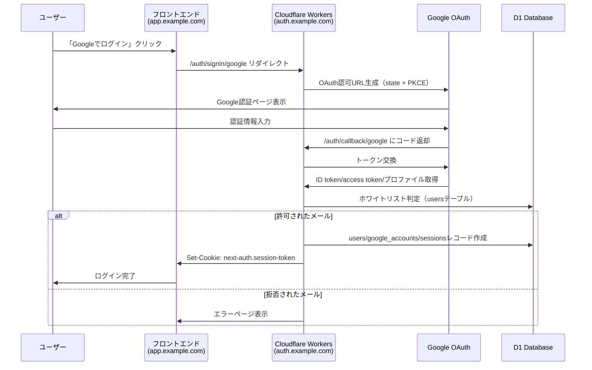

# MLM-DX

MLM-DXは、バンド管理システムです。Next.jsフロントエンド（Cloudflare Pages）とCloudflare Workersバックエンド（D1/SQLite）で構成されています。

## プロジェクト構造

```
mlm-dx/
├── apps/
│   ├── web/          # Next.jsフロントエンド
│   └── worker/       # Cloudflare Workersバックエンド
├── package.json      # ルートレベルの設定
└── README.md
```

## セットアップ

### 1. 依存関係のインストール

```bash
npm install
```

### 2. Cloudflare D1データベースのセットアップ

```bash
# D1データベースを作成
npm run db:create

# マイグレーションを実行
npm run db:migrate

# サンプルデータを投入（オプション）
npm run db:seed
```

### 3. Google OAuth設定

#### 3.1 Google Cloud Console でプロジェクトを作成

1. [Google Cloud Console](https://console.cloud.google.com/)にアクセス
2. 新しいプロジェクトを作成するか、既存のプロジェクトを選択

#### 3.2 OAuth 2.0 認証情報を設定

**OAuth同意画面の設定:**
1. 左側のメニューから「APIとサービス」→「OAuth同意画面」を選択
2. ユーザータイプを選択（外部を推奨）
3. アプリ情報を入力：
   - アプリ名: `MLM-DX`
   - ユーザーサポートメール: あなたのメールアドレス
   - デベロッパーの連絡先情報: あなたのメールアドレス
4. スコープの追加:
   - `.../auth/userinfo.email`
   - `.../auth/userinfo.profile`
5. テストユーザーを追加（開発中は必要）

**OAuth 2.0 クライアントIDの作成:**
1. 「認証情報」タブを選択
2. 「認証情報を作成」→「OAuth 2.0 クライアントID」を選択
3. アプリケーションの種類: `ウェブアプリケーション`
4. 名前: `MLM-DX Worker`
5. **承認済みのJavaScript生成元**を追加:

**開発環境:**
```
http://localhost:3000
http://127.0.0.1:3000
```

**本番環境:**
```
https://your-frontend-domain.com
```

6. **承認済みのリダイレクトURI**を追加:

**開発環境:**
```
http://localhost:8787/auth/callback/google
```

**本番環境:**
```
https://mlm-dx-worker.your-account.workers.dev/auth/callback/google
```

7. 「作成」をクリック
8. クライアントIDとクライアントシークレットをコピー

**重要**: 「承認済みのJavaScript生成元」は**空にしてはいけません**。これはセキュリティ上重要な設定で、クライアントサイドのJavaScriptがGoogleの認証サービスと安全に通信するために必要です。

### 4. 環境変数の設定

#### 4.1 AUTH_SECRETの生成

ターミナルで以下のコマンドを実行:
```bash
openssl rand -base64 32
```

#### 4.2 フロントエンド（apps/web/.env.local）

**開発環境用の設定:**
```env
# API設定
NEXT_PUBLIC_API_URL=http://localhost:8787

# NextAuth設定
NEXTAUTH_URL=http://localhost:3000
NEXTAUTH_SECRET=dev-nextauth-secret-here-min-32-chars-long

# Google OAuth設定（開発環境用）
GOOGLE_CLIENT_ID=your-dev-google-client-id
GOOGLE_CLIENT_SECRET=your-dev-google-client-secret
```

**本番環境用の設定:**
```env
# API設定
NEXT_PUBLIC_API_URL=https://your-worker-domain.workers.dev

# NextAuth設定
NEXTAUTH_URL=https://your-frontend-domain.com
NEXTAUTH_SECRET=prod-nextauth-secret-here-min-32-chars-long

# Google OAuth設定（本番環境用）
GOOGLE_CLIENT_ID=your-prod-google-client-id
GOOGLE_CLIENT_SECRET=your-prod-google-client-secret
```

#### 4.3 バックエンド（apps/worker/wrangler.toml）

```toml
name = "mlm-dx-worker"
main = "src/index.ts"
compatibility_date = "2024-01-01"

[env.development]
name = "mlm-dx-worker-dev"

[env.production]
name = "mlm-dx-worker"

[[d1_databases]]
binding = "DB"
database_name = "mlm-dx-db"
database_id = "your-production-database-id"

[[env.development.d1_databases]]
binding = "DB"
database_name = "mlm-dx-db-dev"
database_id = "your-dev-database-id"

# 共通設定
[vars]
AUTH_SECRET = "your-auth-secret-here-min-32-chars-long"
CORS_ORIGIN = "https://your-frontend-domain.com"
FRONTEND_URL = "https://your-frontend-domain.com"

# 本番環境設定
[env.production.vars]
AUTH_SECRET = "prod-auth-secret-here-min-32-chars-long"
CORS_ORIGIN = "https://your-frontend-domain.com"
FRONTEND_URL = "https://your-frontend-domain.com"
GOOGLE_CLIENT_ID = "your-production-google-client-id"
GOOGLE_CLIENT_SECRET = "your-production-google-client-secret"
YOUTUBE_REFRESH_TOKEN = "your-youtube-oauth-refresh-token"

# 開発環境設定
[env.development.vars]
AUTH_SECRET = "dev-auth-secret-here-min-32-chars-long-for-development"
CORS_ORIGIN = "http://localhost:3000"
FRONTEND_URL = "http://localhost:3000"
GOOGLE_CLIENT_ID = "your-dev-google-client-id"
GOOGLE_CLIENT_SECRET = "your-dev-google-client-secret"
YOUTUBE_REFRESH_TOKEN = "your-youtube-oauth-refresh-token-for-dev"
```

#### 4.4 環境変数の詳細説明

**フロントエンド環境変数:**

| 変数名 | 説明 | 開発環境 | 本番環境 |
|--------|------|----------|----------|
| `NEXT_PUBLIC_API_URL` | バックエンドAPIのURL | `http://localhost:8787` | `https://your-worker-domain.workers.dev` |
| `NEXTAUTH_URL` | NextAuthのベースURL | `http://localhost:3000` | `https://your-frontend-domain.com` |
| `NEXTAUTH_SECRET` | NextAuthの暗号化キー | 開発用32文字以上の文字列 | 本番用32文字以上の文字列 |
| `GOOGLE_CLIENT_ID` | Google OAuth クライアントID | 開発環境用のクライアントID | 本番環境用のクライアントID |
| `GOOGLE_CLIENT_SECRET` | Google OAuth クライアントシークレット | 開発環境用のシークレット | 本番環境用のシークレット |

**バックエンド環境変数:**

| 変数名 | 説明 | 開発環境 | 本番環境 |
|--------|------|----------|----------|
| `AUTH_SECRET` | Auth.jsの暗号化キー | 開発用32文字以上の文字列 | 本番用32文字以上の文字列 |
| `CORS_ORIGIN` | CORS許可オリジン | `http://localhost:3000` | `https://your-frontend-domain.com` |
| `FRONTEND_URL` | フロントエンドのURL | `http://localhost:3000` | `https://your-frontend-domain.com` |
| `GOOGLE_CLIENT_ID` | Google OAuth クライアントID | 開発環境用のクライアントID | 本番環境用のクライアントID |
| `GOOGLE_CLIENT_SECRET` | Google OAuth クライアントシークレット | 開発環境用のシークレット | 本番環境用のシークレット |
| `YOUTUBE_REFRESH_TOKEN` | YouTube API用リフレッシュトークン | 開発環境用のトークン | 本番環境用のトークン |

**注意事項:**
- `AUTH_SECRET`と`NEXTAUTH_SECRET`は最低32文字以上のランダムな文字列である必要があります
- 開発環境と本番環境では**必ず異なる**クライアントIDとシークレットを使用してください
- 本番環境では`https`プロトコルを使用し、適切なドメインを設定してください

### 5. 開発サーバーの起動

#### ローカル開発（推奨）
```bash
# フロントエンドとバックエンドを並行実行（ローカル）
npm run dev:all:local

# または個別に実行
npm run dev              # フロントエンド
npm run dev:worker:local  # バックエンド（ローカル）
```

#### リモート開発
```bash
# フロントエンドとバックエンドを並行実行（リモート）
npm run dev:all

# または個別に実行
npm run dev        # フロントエンド
npm run dev:worker  # バックエンド（リモート）
```

## デプロイ

### Cloudflare Workers

```bash
npm run deploy:worker
```

### Next.js（Cloudflare Pages）

apps/web:
```bash
npm run build:cf        # .vercel/output を生成
npm run preview         # ローカルプレビュー（wrangler pages dev）
npm run deploy          # Cloudflare Pages へデプロイ
```

## 機能

- ユーザー認証（Google OAuth + Auth.js）
- バンド管理
- メンバー管理
- 予約管理
- アーカイブ管理

## 認証システム

### 新しい認証ワークフロー

1. ユーザーがNext.js上の「Sign in with Google」ボタンを押す
2. フロントエンドがWorkers側の`/auth/signin/google`にリダイレクト
3. Auth.js（Workers側）がOAuth認可URLを生成し、Googleの認可エンドポイントへリダイレクト
4. Googleが認可後に`/auth/callback/google`にコードで戻す
5. Auth.jsがコードを交換し、ID token/access token/ユーザープロファイルを取得
6. **ホワイトリスト判定**：取得したemailをD1の`users`テーブルと照合
7. 許可される場合はAuth.jsがusers/google_accounts/sessionsレコードを作成
8. Auth.jsが発行したセッション（sessionToken）をブラウザにSet-Cookieで返す
9. フロントエンド（app.example.com）にリダイレクトして戻る

### 認証フロー図



### データベース構造

```sql
-- アプリケーションのユーザー情報（ホワイトリスト兼用）
users (
  id, student_number, name, nickname, email, 
  instruments, grade, role, image, 
  created_at, updated_at
)

-- Google OAuth連携情報
google_accounts (
  id, user_id, google_id, refresh_token, 
  access_token, expires_at, token_type, 
  scope, id_token, session_state,
  created_at, updated_at
)

-- セッション管理
sessions (
  id, session_token, user_id, expires,
  created_at, updated_at
)
```

### セキュリティ設定

- **クロスサブドメイン対応**: `SameSite=None; Secure`クッキー設定
- **ホワイトリスト制御**: `users`テーブルに登録されたメールアドレスのみログイン可能
- **セッション管理**: データベース戦略でセッション管理
- **PKCE対応**: OAuth 2.0のセキュリティ強化

## 主なAPIエンドポイント

### 認証
- `GET /auth/signin/google` - Googleログイン開始
- `GET /auth/callback/google` - Google認証コールバック
- `GET /auth/session` - セッション情報取得
- `POST /auth/signout` - ログアウト

### ユーザー管理
- `GET /users/fetch/:email` - ユーザー情報取得
- `PUT /users/update` - ユーザー情報更新
- `GET /users/groups` - ユーザーのグループ一覧
- `GET /users/holder` - 予約ホルダー情報

### グループ管理
- `GET /groups` - グループ一覧
- `POST /groups/upsert` - グループ作成/更新
- `GET /groups/:id` - グループ詳細
- `PUT /groups/:id` - グループ更新
- `DELETE /groups/:id` - グループ削除

### メンバー管理
- `GET /members/fetch` - メンバー一覧
- `GET /members/list` - メンバーリスト
- `GET /members/nickname/:id` - ニックネーム取得
- `GET /members/group/:groupId` - グループメンバー
- `POST /members/group/:groupId` - メンバー追加
- `DELETE /members/group/:groupId/:userId` - メンバー削除

### 予約管理
- `GET /reservations/fetch` - 予約一覧
- `GET /reservations/user` - ユーザー予約
- `GET /reservations/group/:groupId` - グループ予約
- `POST /reservations/create` - 予約作成
- `PUT /reservations/cancel/:id` - 予約キャンセル

### アーカイブ管理
- `GET /archive/group/:groupId` - アーカイブ一覧
- `POST /archive/group/:groupId` - アーカイブ追加
- `PUT /archive/:id` - アーカイブ更新
- `DELETE /archive/:id` - アーカイブ削除

### YouTubeアーカイブ
- `GET /archive/youtube/playlists` - 自アカウントの限定公開プレイリスト一覧を返す

## トラブルシューティング

### リダイレクトURIのエラー
- Google Cloud Consoleで設定したリダイレクトURIが正確であることを確認
- プロトコル（http/https）とポート番号も含めて完全一致する必要があります

### JavaScript生成元のエラー
- 「承認済みのJavaScript生成元」が空の場合、`Error 400: redirect_uri_mismatch`が発生します
- 開発環境では`http://localhost:3000`と`http://127.0.0.1:3000`を設定
- 本番環境では`https://your-frontend-domain.com`を設定
- ワイルドカード（`*`）は使用できません

### AUTH_SECRETのエラー
- 32文字以上のランダムな文字列であることを確認
- 特殊文字が含まれている場合は、TOMLファイルで引用符で囲む

### CORSエラー
- `CORS_ORIGIN`がフロントエンドのURLと一致していることを確認
- カンマ区切りで複数のオリジンを指定可能: `"http://localhost:3000,https://example.com"`

### データベースエラー
- マイグレーションが正しく実行されていることを確認
- `users`テーブルに事前にユーザーを登録する必要があります

### 認証フローのテスト
1. ブラウザで `http://localhost:8787/auth/signin` にアクセス
2. Googleアカウントでログイン
3. 認証が成功すると、フロントエンドにリダイレクトされます

### セッション情報の確認
```bash
curl http://localhost:8787/auth/session
```