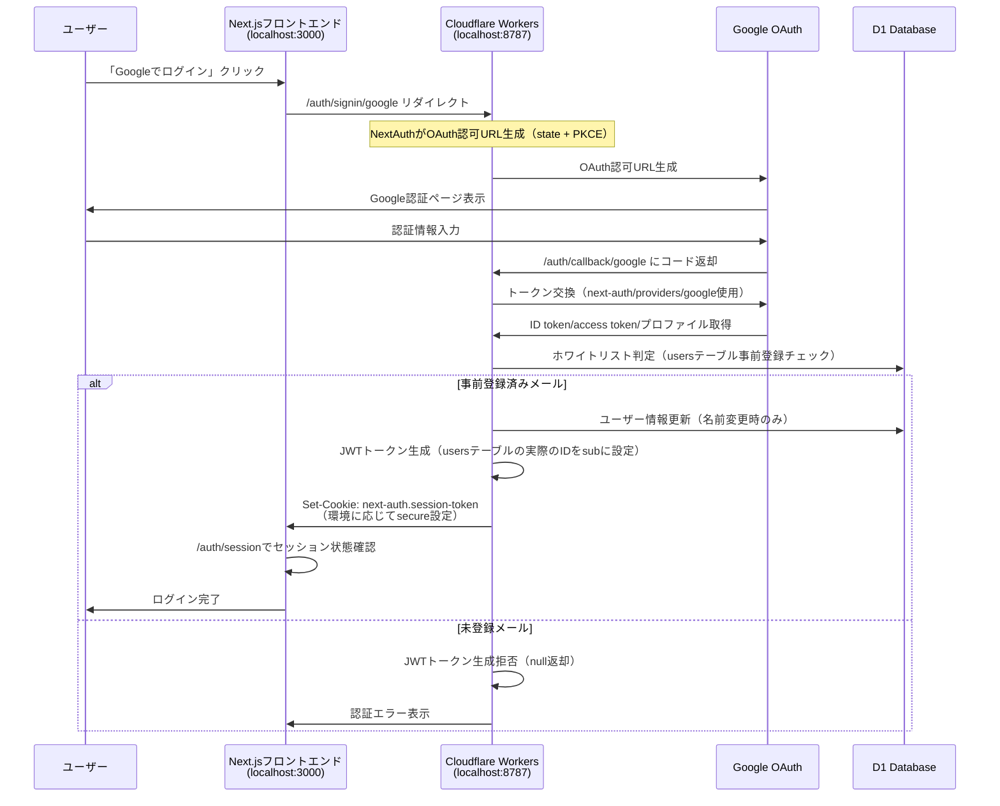

# MLM-DX

MLM-DXは、バンド管理システムです。Next.jsフロントエンド（Cloudflare Pages）とCloudflare Workersバックエンド（D1/SQLite）で構成されています。

## プロジェクト構造

```
mlm-dx/
├── apps/
│   ├── web/          # Next.jsフロントエンド
│   └── worker/       # Cloudflare Workersバックエンド
├── package.json      # ルートレベルの設定
└── README.md
```

## セットアップ

### 1. 依存関係のインストール

```bash
npm install
```

### 2. Cloudflare D1データベースのセットアップ

#### ローカル開発環境
```bash
# ローカルD1データベースを作成
npm run db:create:local

# マイグレーションを実行
npm run db:migrate:local

# サンプルデータを投入（オプション）
npm run db:seed:local

# または一括でセットアップ
npm run db:setup:local
```

#### 開発環境（クラウド）
```bash
# 開発環境D1データベースを作成
npm run db:create:dev

# マイグレーションを実行
npm run db:migrate:dev

# サンプルデータを投入（オプション）
npm run db:seed:dev

# または一括でセットアップ
npm run db:setup:dev
```

#### 本番環境（クラウド）
```bash
# 本番環境D1データベースを作成
npm run db:create:prod

# マイグレーションを実行
npm run db:migrate:prod

# サンプルデータを投入（オプション）
npm run db:seed:prod

# または一括でセットアップ
npm run db:setup:prod
```

### 3. Google OAuth設定

#### 3.1 Google Cloud Console でプロジェクトを作成

1. [Google Cloud Console](https://console.cloud.google.com/)にアクセス
2. 新しいプロジェクトを作成するか、既存のプロジェクトを選択

#### 3.2 OAuth 2.0 認証情報を設定

**OAuth同意画面の設定:**
1. 左側のメニューから「APIとサービス」→「OAuth同意画面」を選択
2. ユーザータイプを選択（外部を推奨）
3. アプリ情報を入力：
   - アプリ名: `MLM-DX`
   - ユーザーサポートメール: あなたのメールアドレス
   - デベロッパーの連絡先情報: あなたのメールアドレス
4. スコープの追加:
   - `.../auth/userinfo.email`
   - `.../auth/userinfo.profile`
5. テストユーザーを追加（開発中は必要）

**OAuth 2.0 クライアントIDの作成:**
1. 「認証情報」タブを選択
2. 「認証情報を作成」→「OAuth 2.0 クライアントID」を選択
3. アプリケーションの種類: `ウェブアプリケーション`
4. 名前: `MLM-DX Worker`
5. **承認済みのJavaScript生成元**を追加:

**開発環境:**
```
http://localhost:3000
http://127.0.0.1:3000
```

**本番環境:**
```
https://your-frontend-domain.com
```

6. **承認済みのリダイレクトURI**を追加:

**開発環境:**
```
http://localhost:8787/auth/callback/google
```

**本番環境:**
```
https://mlm-dx-worker.your-account.workers.dev/auth/callback/google
```

7. 「作成」をクリック
8. クライアントIDとクライアントシークレットをコピー

### 4. 環境変数の設定

#### 4.1 AUTH_SECRETの生成

ターミナルで以下のコマンドを実行:
```bash
openssl rand -base64 32
```

#### 4.2 フロントエンド（apps/web/.env.local）

**開発環境用の設定:**
```env
# 環境設定
NODE_ENV=development

# API設定
NEXT_PUBLIC_API_URL=http://localhost:8787

# Auth.js設定
AUTH_SECRET=dev-nextauth-secret-here-min-32-chars-long
GOOGLE_CLIENT_ID=your-dev-google-client-id
GOOGLE_CLIENT_SECRET=your-dev-google-client-secret
```

**本番環境用の設定:**
```env
# 環境設定
NODE_ENV=production

# API設定
NEXT_PUBLIC_API_URL=https://your-worker-domain.workers.dev

# Auth.js設定
AUTH_SECRET=prod-nextauth-secret-here-min-32-chars-long
GOOGLE_CLIENT_ID=your-prod-google-client-id
GOOGLE_CLIENT_SECRET=your-prod-google-client-secret
```

#### 4.3 バックエンド（apps/worker/wrangler.toml）

```toml
name = "mlm-dx-worker"
main = "src/index.ts"
compatibility_date = "2024-01-01"

[env.development]
name = "mlm-dx-worker-dev"

[env.production]
name = "mlm-dx-worker"

[[d1_databases]]
binding = "DB"
database_name = "mlm-dx-db"
database_id = "your-production-database-id"

[[env.development.d1_databases]]
binding = "DB"
database_name = "mlm-dx-db-dev"
database_id = "your-dev-database-id"

# 共通設定
[vars]
AUTH_SECRET = "your-auth-secret-here-min-32-chars-long"
CORS_ORIGIN = "https://your-frontend-domain.com"
FRONTEND_URL = "https://your-frontend-domain.com"

# 本番環境設定
[env.production.vars]
AUTH_SECRET = "prod-auth-secret-here-min-32-chars-long"
CORS_ORIGIN = "https://your-frontend-domain.com"
FRONTEND_URL = "https://your-frontend-domain.com"
GOOGLE_CLIENT_ID = "your-production-google-client-id"
GOOGLE_CLIENT_SECRET = "your-production-google-client-secret"
YOUTUBE_REFRESH_TOKEN = "your-youtube-oauth-refresh-token"

# 開発環境設定
[env.development.vars]
AUTH_SECRET = "dev-auth-secret-here-min-32-chars-long-for-development"
CORS_ORIGIN = "http://localhost:3000"
FRONTEND_URL = "http://localhost:3000"
GOOGLE_CLIENT_ID = "your-dev-google-client-id"
GOOGLE_CLIENT_SECRET = "your-dev-google-client-secret"
YOUTUBE_REFRESH_TOKEN = "your-youtube-oauth-refresh-token-for-dev"
```

#### 4.4 環境変数の詳細説明

**フロントエンド環境変数:**

| 変数名 | 説明 | 開発環境 | 本番環境 |
|--------|------|----------|----------|
| `NODE_ENV` | 環境設定（クッキーのsecure設定に影響） | `development` | `production` |
| `NEXT_PUBLIC_API_URL` | バックエンドAPIのURL | `http://localhost:8787` | `https://your-worker-domain.workers.dev` |
| `AUTH_SECRET` | Auth.jsの暗号化キー | 開発用32文字以上の文字列 | 本番用32文字以上の文字列 |
| `GOOGLE_CLIENT_ID` | Google OAuth クライアントID | 開発環境用のクライアントID | 本番環境用のクライアントID |
| `GOOGLE_CLIENT_SECRET` | Google OAuth クライアントシークレット | 開発環境用のシークレット | 本番環境用のシークレット |

**バックエンド環境変数:**

| 変数名 | 説明 | 開発環境 | 本番環境 |
|--------|------|----------|----------|
| `NODE_ENV` | 環境設定（クッキーのsecure設定に影響） | `development` | `production` |
| `AUTH_SECRET` | Auth.jsの暗号化キー | 開発用32文字以上の文字列 | 本番用32文字以上の文字列 |
| `CORS_ORIGIN` | CORS許可オリジン | `http://localhost:3000` | `https://your-frontend-domain.com` |
| `FRONTEND_URL` | フロントエンドのURL | `http://localhost:3000` | `https://your-frontend-domain.com` |
| `GOOGLE_CLIENT_ID` | Google OAuth クライアントID | 開発環境用のクライアントID | 本番環境用のクライアントID |
| `GOOGLE_CLIENT_SECRET` | Google OAuth クライアントシークレット | 開発環境用のシークレット | 本番環境用のシークレット |
| `YOUTUBE_REFRESH_TOKEN` | YouTube API用リフレッシュトークン | 開発環境用のトークン | 本番環境用のトークン |

**注意事項:**
- `AUTH_SECRET`は最低32文字以上のランダムな文字列である必要があります
- `NODE_ENV`の設定により、クッキーの`secure`属性が自動的に制御されます（開発環境: `false`、本番環境: `true`）
- 開発環境と本番環境では**必ず異なる**クライアントIDとシークレットを使用してください
- 本番環境では`https`プロトコルを使用し、適切なドメインを設定してください
- 認証はワーカー側のみで実行され、フロントエンドはワーカー側の認証エンドポイントにリダイレクトします

### 5. 開発サーバーの起動

#### ローカル開発（推奨）
```bash
# フルスタック開発環境を起動（全てローカル）
npm run dev

# または明示的にローカル環境を指定
npm run dev:local

# 個別に実行
npm run dev:web           # フロントエンド（Next.js）
npm run dev:worker:local  # バックエンド（Wrangler ローカル）
```

#### クラウド開発（本番環境テスト用）
```bash
# バックエンドのみクラウド環境で実行
npm run dev:worker:cloud

# フロントエンドはローカル、バックエンドはクラウド
npm run dev:web
npm run dev:worker:cloud
```

## デプロイ

### 本番環境へのデプロイ

#### フルスタックデプロイ
```bash
# 本番環境にフルスタックデプロイ
npm run deploy:all:prod

# 開発環境にフルスタックデプロイ
npm run deploy:all:dev
```

#### 個別デプロイ

**Cloudflare Workers:**
```bash
# 本番環境
npm run deploy:worker:prod

# 開発環境
npm run deploy:worker:dev
```

**Next.js（Cloudflare Pages）:**
```bash
# 本番環境
npm run deploy:web:prod

# 開発環境
npm run deploy:web:dev
```

### ビルド

#### ローカルビルド（開発用）
```bash
# ローカル用ビルド
npm run build:local

# 個別ビルド
npm run build:web
npm run build:worker:local
```

#### クラウドビルド（デプロイ用）
```bash
# クラウド用ビルド
npm run build:all:cloud

# 個別ビルド
npm run build:web
npm run build:worker:cloud
```

### データベース管理

#### ローカル環境
```bash
# ローカルDB設定（マイグレーション + シード）
npm run db:setup:local

# 個別実行
npm run db:migrate:local
npm run db:seed:local
```

#### 開発環境（クラウド）
```bash
# 開発環境DB設定
npm run db:setup:dev

# 個別実行
npm run db:migrate:dev
npm run db:seed:dev
```

#### 本番環境（クラウド）
```bash
# 本番環境DB設定
npm run db:setup:prod

# 個別実行
npm run db:migrate:prod
npm run db:seed:prod
```

## 機能

- ユーザー認証（Google OAuth + Auth.js）
- バンド管理
- メンバー管理
- 予約管理
- アーカイブ管理

## 認証システム

### 統一されたNextAuth認証ワークフロー

認証システムは**ワーカー側のみ**でNextAuthを実行し、フロントエンドはワーカー側の認証エンドポイントにリダイレクトする方式を採用しています。これにより、設定の重複を避け、ホワイトリスト判定とJWTの整合性を保証しています。

#### 認証フローの特徴

1. **統一された認証処理**: NextAuthの設定はワーカー側のみに存在
2. **ホワイトリスト制御**: `users`テーブルに事前登録されたメールアドレスのみログイン可能
3. **環境対応セキュリティ**: 開発環境では`secure: false`、本番環境では`secure: true`
4. **クロスオリジン対応**: `__Host-`プレフィックスを削除してクロスオリジン間でのセッション共有を実現

#### 認証フロー詳細

1. ユーザーがフロントエンドの「Googleでログイン」ボタンをクリック
2. フロントエンドがワーカー側の`/auth/signin/google`にリダイレクト
3. ワーカー側のNextAuthがOAuth認可URLを生成し、Googleの認可エンドポイントへリダイレクト
4. Googleが認可後に`/auth/callback/google`にコードで戻す
5. ワーカー側のNextAuthがコードを交換し、ID token/access token/ユーザープロファイルを取得
6. **ホワイトリスト判定**: 取得したemailをD1の`users`テーブルと照合
7. 許可される場合はワーカー側のNextAuthがJWTトークン生成（usersテーブルの実際のIDをsubに設定）
8. セッションクッキー（`next-auth.session-token`）をブラウザにSet-Cookieで返す
9. フロントエンドにリダイレクトし、ワーカー側の`/auth/session`エンドポイントでセッション状態を管理

### 認証フロー図



### ホワイトリスト運用

**重要**: `users`テーブルは事前登録専用です。新しいユーザーを追加するには、管理者が手動でデータベースにレコードを挿入する必要があります。

#### 新しいユーザーの追加方法

```sql
-- 新しいユーザーを追加
INSERT INTO users (
  id, student_number, name, email, instruments, grade, role, 
  created_at, updated_at
) VALUES (
  'user-uuid-here',           -- 一意のUUID
  'student123',               -- 学籍番号
  '田中太郎',                  -- 表示名
  'tanaka@example.com',       -- Googleアカウントのメールアドレス
  '["VO", "GT"]',             -- 楽器（JSON配列）
  3,                          -- 学年
  'MBR',                      -- ロール（MBR: メンバー）
  datetime('now'),            -- 作成日時
  datetime('now')             -- 更新日時
);
```

#### ロール一覧

| ロール | 説明 |
|--------|------|
| `ADM` | 管理者 |
| `MGR` | マネージャー |
| `CHF` | チーフ |
| `MACT` | メインアクト |
| `MBR` | メンバー |
| `NHD` | 新入生 |
| `NACT` | 新入生アクト |

#### 楽器一覧

| 楽器 | 説明 |
|------|------|
| `VO` | ボーカル |
| `GT` | ギター |
| `KEY` | キーボード |
| `DR` | ドラム |
| `BA` | ベース |

### セキュリティ設定

- **環境対応セキュリティ**: 開発環境では`secure: false`、本番環境では`secure: true`でクッキーのセキュリティを制御
- **クロスオリジン対応**: `__Host-`プレフィックスを削除してクロスオリジン間でのセッション共有を実現
- **ホワイトリスト制御**: `users`テーブルに登録されたメールアドレスのみログイン可能
- **セッション管理**: JWT戦略でセッション管理（署名検証付き）
- **PKCE対応**: OAuth 2.0のセキュリティ強化
- **JWT署名検証**: HMAC-SHA256による署名検証でトークン偽造を防止

## 主なAPIエンドポイント

### 認証
- `POST /auth/signin/google` - Googleログイン開始（Auth.js API）
- `GET /auth/callback/google` - Google認証コールバック（Auth.js API）
- `GET /auth/session` - セッション情報取得（Auth.js API）
- `POST /auth/signout` - ログアウト（Auth.js API）

### ユーザー管理
- `GET /users/fetch/:email` - ユーザー情報取得
- `PUT /users/update` - ユーザー情報更新
- `GET /users/groups` - ユーザーのグループ一覧
- `GET /users/holder` - 予約ホルダー情報

### グループ管理
- `GET /groups` - グループ一覧
- `POST /groups/upsert` - グループ作成/更新
- `GET /groups/:id` - グループ詳細
- `PUT /groups/:id` - グループ更新
- `DELETE /groups/:id` - グループ削除

### メンバー管理
- `GET /members/fetch` - メンバー一覧
- `GET /members/list` - メンバーリスト
- `GET /members/nickname/:id` - ニックネーム取得
- `GET /members/group/:groupId` - グループメンバー
- `POST /members/group/:groupId` - メンバー追加
- `DELETE /members/group/:groupId/:userId` - メンバー削除

### 予約管理
- `GET /reservations/fetch` - 予約一覧
- `GET /reservations/user` - ユーザー予約
- `GET /reservations/group/:groupId` - グループ予約
- `POST /reservations/create` - 予約作成
- `PUT /reservations/cancel/:id` - 予約キャンセル

### アーカイブ管理
- `GET /archive/group/:groupId` - アーカイブ一覧
- `POST /archive/group/:groupId` - アーカイブ追加
- `PUT /archive/:id` - アーカイブ更新
- `DELETE /archive/:id` - アーカイブ削除

### YouTubeアーカイブ
- `GET /archive/youtube/playlists` - 自アカウントの限定公開プレイリスト一覧を返す

## トラブルシューティング

### リダイレクトURIのエラー
- Google Cloud Consoleで設定したリダイレクトURIが正確であることを確認
- プロトコル（http/https）とポート番号も含めて完全一致する必要があります

### JavaScript生成元のエラー
- 「承認済みのJavaScript生成元」が空の場合、`Error 400: redirect_uri_mismatch`が発生します
- 開発環境では`http://localhost:3000`と`http://127.0.0.1:3000`を設定
- 本番環境では`https://your-frontend-domain.com`を設定
- ワイルドカード（`*`）は使用できません

### AUTH_SECRETのエラー
- 32文字以上のランダムな文字列であることを確認
- 特殊文字が含まれている場合は、TOMLファイルで引用符で囲む

### CORSエラー
- `CORS_ORIGIN`がフロントエンドのURLと一致していることを確認
- カンマ区切りで複数のオリジンを指定可能: `"http://localhost:3000,https://example.com"`

### データベースエラー
- マイグレーションが正しく実行されていることを確認
- `users`テーブルに事前にユーザーを登録する必要があります

### セッションクッキーの問題

- **開発環境でセッションが保持されない**: `NODE_ENV=development`が設定されていることを確認
- **本番環境でセッションが保持されない**: `NODE_ENV=production`が設定され、HTTPS環境であることを確認
- **クロスオリジンでセッションが送信されない**: `__Host-`プレフィックスが削除されていることを確認

### 認証フローのテスト
1. ブラウザで `http://localhost:8787/auth/signin/google` にアクセス
2. Googleアカウントでログイン
3. 認証が成功すると、フロントエンドにリダイレクトされます

### セッション情報の確認
```bash
curl http://localhost:8787/auth/session
```

## npmスクリプト一覧

### 開発環境（ローカル）

| スクリプト | 説明 |
|-----------|------|
| `npm run dev` | フルスタック開発環境を起動（ローカル） |
| `npm run dev:local` | フルスタック開発環境を起動（ローカル） |
| `npm run dev:web` | フロントエンドのみ起動 |
| `npm run dev:worker:local` | バックエンドのみ起動（ローカル） |
| `npm run build:local` | ローカル用ビルド |
| `npm run db:setup:local` | ローカルDB設定 |

### 本番環境（クラウド）

| スクリプト | 説明 |
|-----------|------|
| `npm run dev:worker:cloud` | バックエンドのみ起動（クラウド） |
| `npm run build:all:cloud` | クラウド用ビルド |
| `npm run deploy:all:prod` | 本番環境にフルスタックデプロイ |
| `npm run deploy:all:dev` | 開発環境にフルスタックデプロイ |
| `npm run deploy:worker:prod` | 本番環境にWorkerデプロイ |
| `npm run deploy:worker:dev` | 開発環境にWorkerデプロイ |
| `npm run deploy:web:prod` | 本番環境にWebデプロイ |
| `npm run deploy:web:dev` | 開発環境にWebデプロイ |
| `npm run db:setup:prod` | 本番DB設定 |
| `npm run db:setup:dev` | 開発DB設定 |

### ユーティリティ

| スクリプト | 説明 |
|-----------|------|
| `npm run lint` | 全プロジェクトのリント |
| `npm run lint:web` | フロントエンドのリント |
| `npm run lint:worker` | バックエンドのリント |
| `npm run type-check` | 型チェック |
| `npm run clean` | 全ビルド成果物を削除 |
| `npm run clean:local` | ローカルビルド成果物を削除 |
| `npm run install:all` | 全依存関係をインストール |