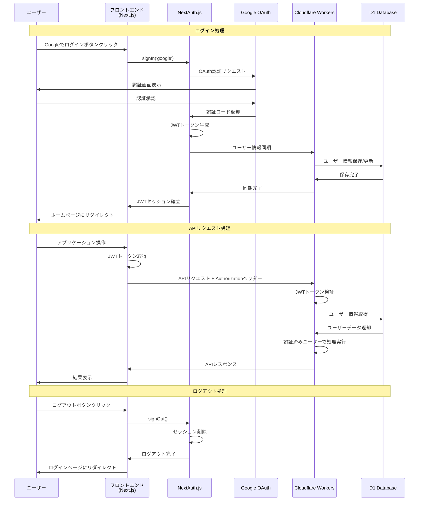

# MLM-DX Web Frontend

Next.jsを使用したMLM-DXのフロントエンドアプリケーションです。

## セットアップ

```bash
npm install
```

## 環境変数の設定

`.env.local`ファイルを作成し、以下の環境変数を設定してください：

```env
# API設定
NEXT_PUBLIC_API_URL=http://localhost:8787

# NextAuth設定
NEXTAUTH_URL=http://localhost:3000
NEXTAUTH_SECRET=your-nextauth-secret-here-min-32-chars-long

# Google OAuth設定
GOOGLE_CLIENT_ID=your-google-client-id
GOOGLE_CLIENT_SECRET=your-google-client-secret
```

### Google OAuth設定

1. [Google Cloud Console](https://console.cloud.google.com/)でプロジェクトを作成
2. OAuth 2.0クライアントIDを作成
3. 認証済みリダイレクトURIを追加:
   - 開発環境: `http://localhost:3000/api/auth/callback/google`
   - 本番環境: `https://your-frontend-domain.com/api/auth/callback/google`

### NEXTAUTH_SECRETの生成

```bash
openssl rand -base64 32
```

## 開発サーバーの起動

```bash
npm run dev
```

## ビルド

```bash
npm run build
```

## 認証フロー

1. ユーザーが「Googleでログイン」ボタンをクリック
2. NextAuthがGoogle OAuth認証を処理
3. 認証成功後、Cloudflare WorkersのAPIにユーザー情報を同期
4. セッションが確立され、アプリケーションにアクセス可能

### 認証フロー図



## API クライアント

`lib/api.ts`にAPIクライアントが実装されており、以下の機能を提供します：

- 認証（セッション取得、ログアウト）
- バンド管理
- メンバー管理
- 予約管理
- アーカイブ管理

## 認証コンテキスト

`app/context/AuthContext.tsx`で認証状態を管理し、以下の機能を提供します：

- ユーザー情報の取得
- ログイン状態の監視
- ログアウト機能

## アーキテクチャ

### 認証システム
- **フロントエンド**: NextAuth.js (JWT戦略)
- **バックエンド**: Cloudflare Workers + Auth.js
- **OAuthプロバイダー**: Google

### データフロー
1. NextAuthがGoogle OAuth認証を処理
2. JWTトークンでセッション管理
3. APIリクエスト時にAuthorizationヘッダーでJWT送信
4. Cloudflare WorkersでJWT検証・ユーザー認証

### 主な変更点
- SupabaseからCloudflare Workers + D1に移行
- パスワード認証からGoogle OAuthに変更
- リアルタイム機能は削除（必要に応じて後で実装）